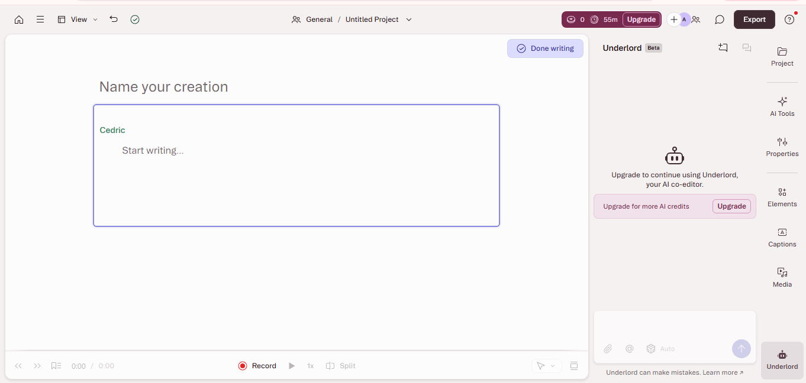

# My Solution
### Steps Followed:
1. Searched for a video on youtube / Online article.
2. Copied the link of the video/ article and paste it in ChatGPT, Summarize the video/ article in the podcast style.
3. Copy the speech and go to Describe to create a new project.
4. In the Describe's 'start writing' window, write down your script and make the changes in settigs as per the requirement.
5. Once completed with editing, create the audio and download in .mp3 format.

---
## 1. Task : make a Podcast out of youtube video
### Tool Used : Descript, ChatGPT

### Resources for Youtube video link to create podcast

[Youtube_video_to_create_podcast](https://www.youtube.com/watch?v=jKBgoX1vGnE)

### Output:

[youtube_video_to_podcast](Audio/Youtube_video_to_podcast.mp3)

---
## 2. Task : Summarize Blogs and make a Podcast out of that
### Tool Used : Descript, ChatGPT
### Article to create podcast
[article_to_create podcast](https://timesofindia.indiatimes.com/blogs/toi-edit-page/my-god-your-god-the-conflict-within/)

### Output:
[article_to_podcast](Audio/Article_to_podcast.mp3)

---