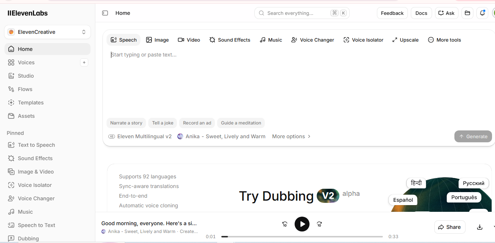

# My Solution
### Steps Followed:
1. Go to ChatGPT and create a 30-sec script to introduce yourself.
2. Go to ElevenLabs, Write your script.
3. Change the settings of the voice - Male/Female/artist name/adult / kid/ old/ cloning your own voice.
4. Generate the voice.
5. Download the mp3 file.

---
## 1. Task : Record a 30 -sec audio introducing yourself
## 2. Task : Generate a audio of Motivational speech using AI
### Tool Used : Elevenlabs, ChatGPT

### Output:

[Motivational_speech](Audio/Elevenlabs_audio.mp3)
