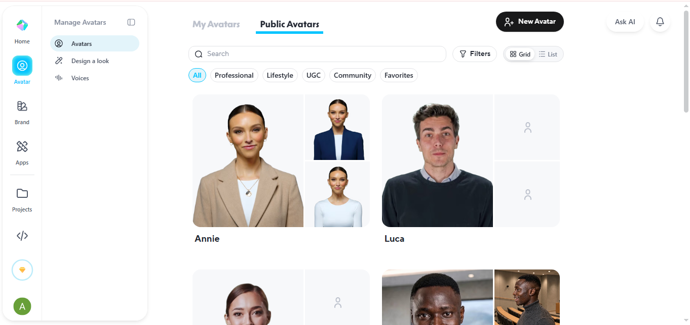

# My Solution
### Steps Followed:
1. Sign in to HeyGen.
2. Click Create Video.
3. Choose a blank project or a template.
4. Click Avatar from the left panel.
5. Select one of the hundreds of available AI avatars.
6. Type or paste your script.
7. Choose:
   - Voice
   - Language
   - Speed
   - Emotion (if available)
8. Customize your video:
   - Background
   - Text
   - Images
   - Music
   - Logo
   - Captions
9. Click Generate.
10. Wait a few minutes and download your video.

---
### Output:

[Heygen_video](video/HeyGen.mp4)

---