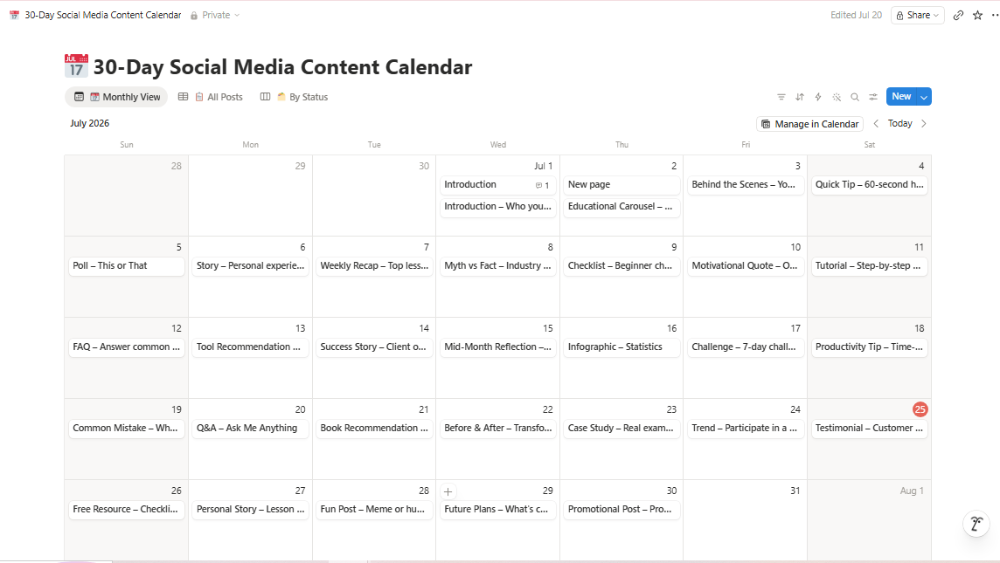
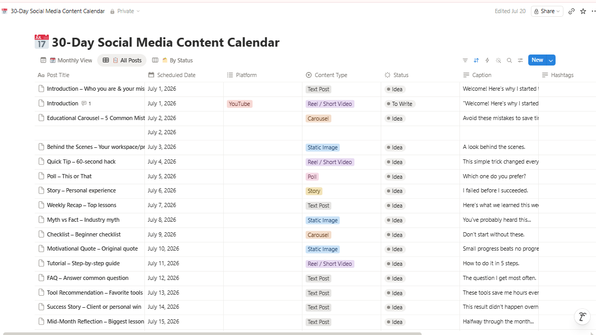
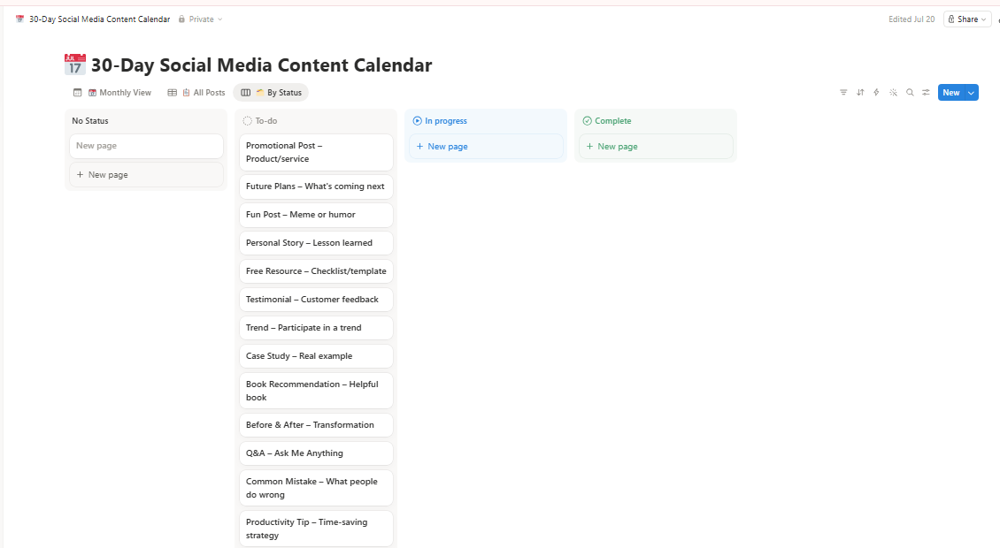

# My Solution

### Tool Used : Notion

### Steps Followed:
1. Sign in to your Notion account.
2. Click **+ New Page**.
3. Name the page **30-Day Social Media Content Calendar**.
4. Select **Table – Full Page** as the database type.
5. Create the following columns:
   - Day
   - Date
   - Platform
   - Content Type
   - Topic
   - Caption
   - Media
   - Hashtags
   - Status
   - Publish Time
6. Add 30 rows (Day 1 to Day 30).
7. Enter the planned content topic for each day.
8. Assign the social media platform for every post.
9. Select the content type (Image, Carousel, Reel, Video, Story, etc.).
10. Write the caption for each post.
11. Add hashtags for every post.
12. Attach or link the media (image/video) if available.
13. Set the publication date and time.
14. Update the **Status** column (Idea, Draft, Ready, Scheduled, Published).
15. Create a **Calendar View** to visualize posts by date.
16. Create a **Board View** grouped by Status.
17. Create a **Gallery View** to preview post thumbnails.
18. Add filters to display posts by platform or status.
19. Sort posts by publication date.
20. Color-code status tags for quick identification.
21. Add a checklist for post completion (Caption, Design, Review, Schedule, Publish).
22. Link related assets such as Canva designs or Google Drive files.
23. Schedule content for the next 30 days.
24. Review the calendar for consistency and content variety.
25. Publish posts according to the schedule.
26. Track engagement metrics after publishing.
27. Update the status to **Published** once live.
28. Record post performance in a Notes or Analytics field.
29. Analyze the best-performing content at the end of the month.
30. Duplicate the database as a template for the next month's content calendar.
---
#### 30-Days Social-media Content Calendar

| Day | Content Type | Topic | Caption Idea | Call-to-Action |
|-----|--------------|-------|--------------|----------------|
| 1 | Introduction | Who you are & your mission | Welcome! Here's why I started this journey. | Introduce yourself |
| 2 | Educational Carousel | 5 Common Mistakes | Avoid these mistakes to save time. | Save this post |
| 3 | Behind the Scenes | Your workspace or process | A look behind the scenes. | Comment your setup |
| 4 | Quick Tip | 60-second productivity hack | This simple trick changed everything. | Share with a friend |
| 5 | Poll | This or That | Which one do you prefer? | Vote below |
| 6 | Personal Story | Your experience | I failed before I succeeded. | Share your story |
| 7 | Weekly Recap | Top lessons learned | Here's what we learned this week. | Save for later |
| 8 | Myth vs Fact | Industry myth | You've probably heard this... | Did you know? |
| 9 | Checklist | Beginner checklist | Don't start without these. | Save this checklist |
| 10 | Motivational Quote | Original quote | Small progress beats no progress. | Tag someone |
| 11 | Tutorial | Step-by-step guide | How to do it in 5 simple steps. | Try it today |
| 12 | FAQ | Answer a common question | The question I get most often. | Ask another question |
| 13 | Tool Recommendation | Favorite tools | These tools save me hours every week. | Which one do you use? |
| 14 | Success Story | Client or personal achievement | This result didn't happen overnight. | Celebrate with 🎉 |
| 15 | Reflection | Mid-month review | Halfway through the month... | Share your biggest lesson |
| 16 | Infographic | Industry statistics | Numbers don't lie. | Save this data |
| 17 | Challenge | 7-day challenge | Join me starting today. | Comment "IN" |
| 18 | Productivity Tip | Time-saving strategy | Work smarter, not harder. | Try it tomorrow |
| 19 | Common Mistake | Things to avoid | Stop doing this immediately. | Agree or disagree? |
| 20 | Q&A | Ask Me Anything | Drop your questions below. | Ask away |
| 21 | Book Recommendation | Helpful book | This book changed my perspective. | Recommend another book |
| 22 | Before & After | Transformation | Consistency creates results. | Share your progress |
| 23 | Case Study | Real-life example | Here's how this worked. | Want more examples? |
| 24 | Trending Content | Participate in a trend | Add your unique twist. | Join the trend |
| 25 | Testimonial | Customer feedback | This made my day. | Thank your supporters |
| 26 | Free Resource | Checklist or template | Grab this free resource. | Download now |
| 27 | Personal Lesson | Biggest learning | One mistake I'll never repeat. | What's yours? |
| 28 | Fun Content | Meme or humor | If you know, you know 😂 | Tag a friend |
| 29 | Future Plans | Upcoming content | Big things are on the way. | Stay tuned |
| 30 | Promotional Post | Product or service | Ready to take the next step? | DM me or visit the link |

---
### Output:

---

