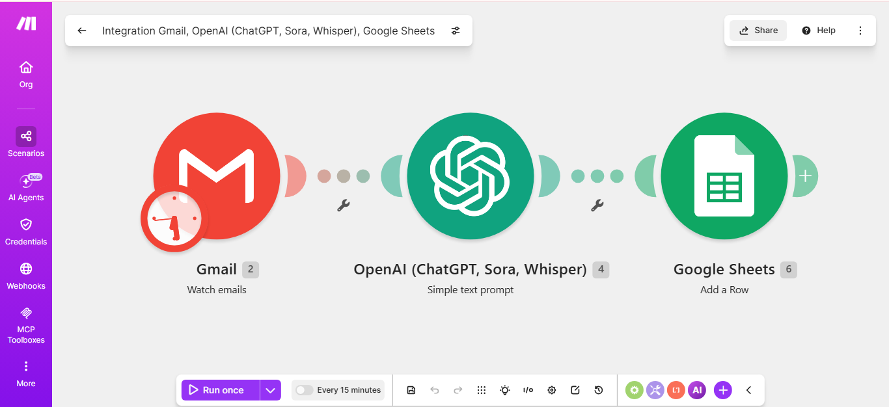
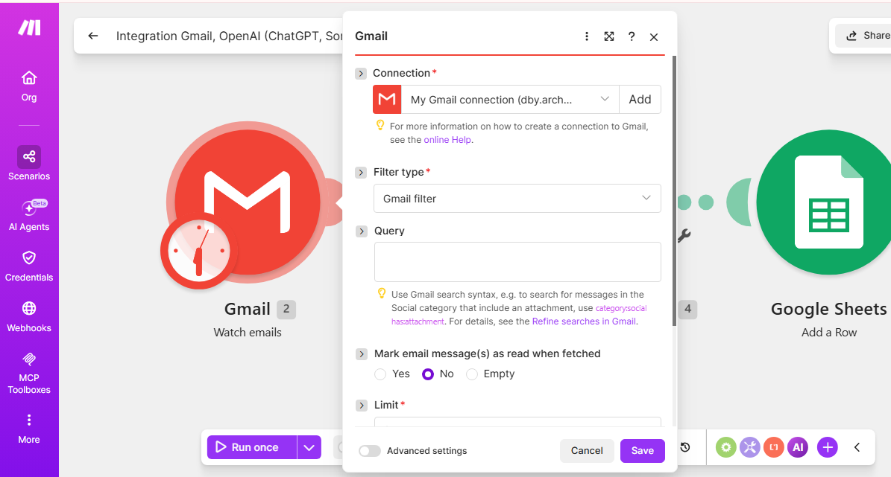
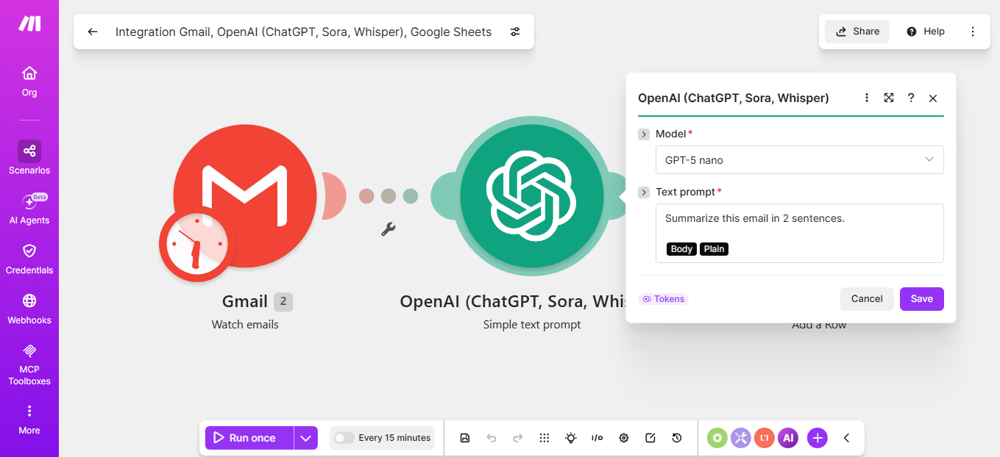
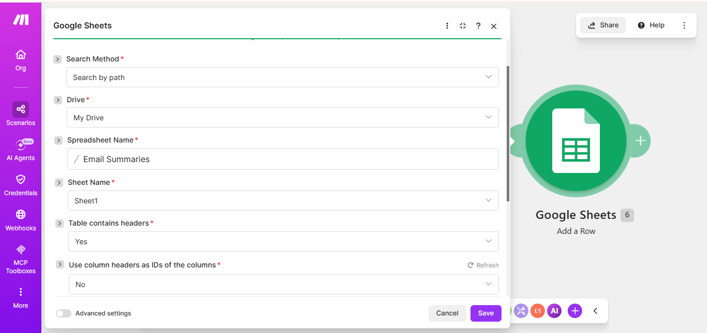
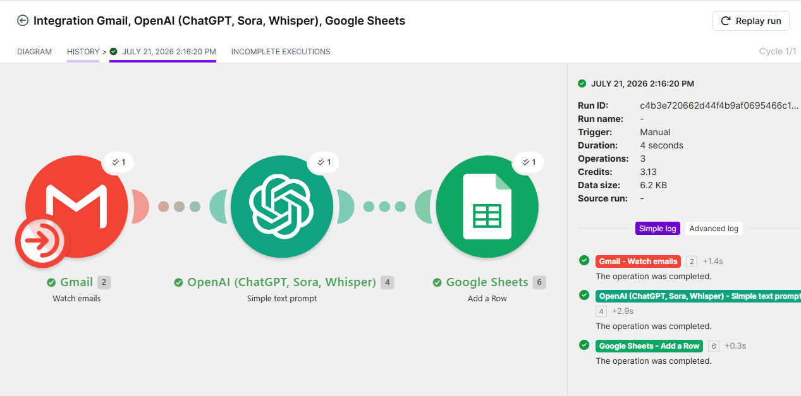
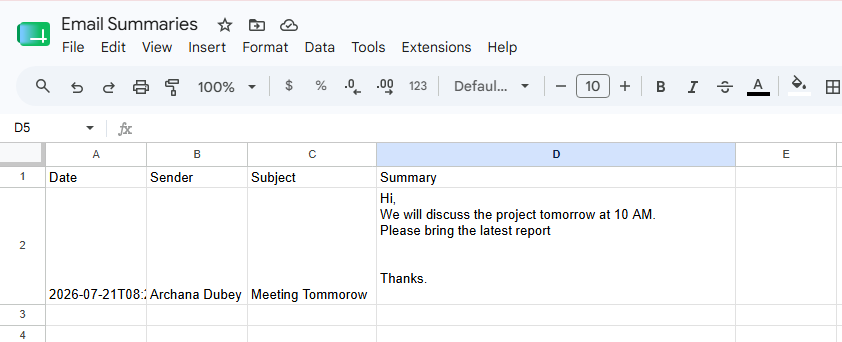

# My Solution

### Tool Used : Make.com

### Steps Followed:
## Steps to Build an AI Email Summarizer with Make.com :

## Step 1: Create a Google Sheet
- Create a new Google Sheet.
- Name it **Email Summaries**.
- Add the following column headers:
  - Date
  - Sender
  - Subject
  - Summary

---

## Step 2: Create a New Scenario
- Log in to Make.com.
- Click **Create a new scenario**.

---

## Step 3: Add the Gmail Module
- Click the **+** button.
- Search for **Gmail**.
- Select **Watch Emails**.
- Connect your Gmail account.
- Choose **Inbox** as the folder.
- Set **Limit = 1** for testing.

---

## Step 4: Test the Gmail Trigger
- Click **Run once**.
- Send a test email to your Gmail account.
- Wait until Make.com detects the email.

---

## Step 5: Add the OpenAI Module
- Click the **+** button after the Gmail module.
- Search for **OpenAI**.
- Select the chat/completions action.
- Connect your OpenAI account or API key.

---

## Step 6: Configure the AI Prompt
- Enter the following prompt:

```text
Summarize the following email in two concise sentences.

{{Body Plain}}
```

---

## Step 7: Add the Google Sheets Module
- Click the **+** button.
- Search for **Google Sheets**.
- Select **Add a Row**.
- Connect your Google account.
- Select the **Email Summaries** spreadsheet.

---

## Step 8: Map the Fields
- Map **Date** to the email date.
- Map **Sender** to the sender's email.
- Map **Subject** to the email subject.
- Map **Summary** to the AI-generated response.

---

## Step 9: Test the Complete Workflow
- Click **Run once**.
- Send another test email.
- Verify that a new row is added to Google Sheets with the generated summary.

---

## Step 10: Save the Scenario
- Save the scenario.
- Give it a meaningful name (e.g., **AI Email Summarizer**).

---

## Step 11: Turn Off Scheduling
- Keep the scenario **OFF** after testing to avoid consuming unnecessary Make.com operations.

---

## Step 12: Enhance the Workflow (Optional)
- Filter only unread emails.
- Ignore promotional emails.
- Categorize emails automatically.
- Save attachments to Google Drive.
- Send summaries to Telegram or Slack.
- Store summaries in Notion.
- Create a daily email digest
---

### Output:






---

