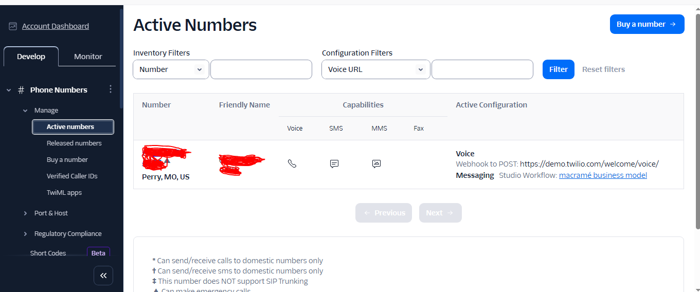
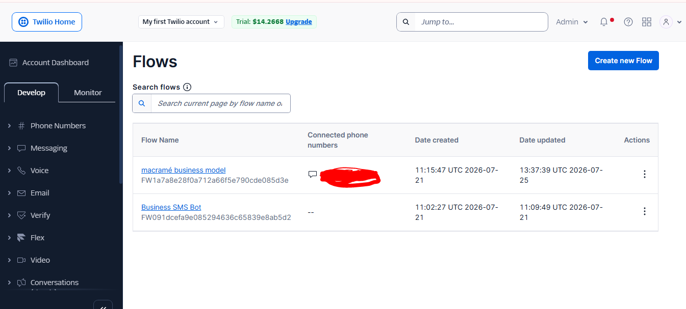
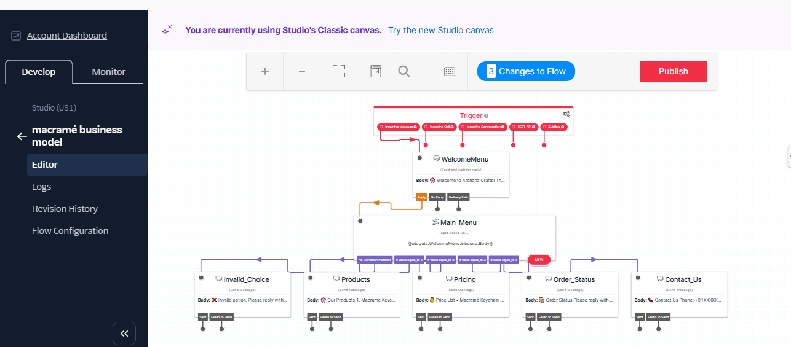

# My Solution

### Tool Used : Twilio

### Project workflow

## Twilio SMS Business Chatbot using Make.com

A no-code business SMS chatbot built using **Twilio** . The workflow receives incoming SMS messages from customers, processes them through a router, and sends automated responses based on customer requests.

---

##  Workflow Overview

```text
Customer
      │
      ▼
Twilio SMS Number
      │
      ▼
Incoming SMS Webhook
      │
      ▼
Make.com
      │
      ▼
Router
├── Greeting
├── Products
├── Price List
├── Order
├── FAQ
├── Human Support
└── AI Assistant
      │
      ▼
Twilio Send SMS
      │
      ▼
Customer receives SMS
```

---

## Project Objective

Build an automated SMS chatbot that:

- Greets customers automatically
- Shares product information
- Provides pricing details
- Handles order inquiries
- Answers frequently asked questions
- Transfers customers to human support when needed
- Uses AI to answer general questions

---

## Technologies Used

- Twilio SMS
- Make.com
- Webhooks
- Router Module
- AI Assistant (OpenAI or other LLM)
- HTTP Modules (Optional)
- Google Sheets (Optional)

---

## Workflow Modules

## 1. Customer

The customer sends an SMS to the Twilio phone number.

Example:

```
Hi
```

or

```
Price
```

---

## 2. Twilio SMS Number

Receives incoming SMS messages.

Example:

```
+1 XXX XXX XXXX
```

The message is forwarded to the configured webhook.

---

## 3. Incoming SMS Webhook

Acts as the entry point of the automation.

Responsibilities:

- Receive SMS
- Capture sender phone number
- Capture message body
- Forward data to Make.com

---

## 4. Make.com Scenario

Processes incoming messages.

Responsibilities:

- Receive webhook data
- Parse message content
- Route requests
- Generate responses
- Send SMS replies

---

## 5. Router

Routes incoming messages to different business flows.

### Greeting

Triggers when the customer sends:

```
Hi
Hello
Hey
Start
```

Response:

```
Welcome to Archana Crafts!

Reply with:

1 Products
2 Price List
3 Order Status
4 FAQ
5 Human Support
6 AI Assistant
```

---

### Products

Shows available products.

Example response:

```
Our Products

• Macramé Keychains
• Beaded Bracelets
• Wall Hangings
• Custom Gifts
```

---

### Price List

Displays product prices.

Example:

```
Macramé Keychain - ₹199

Bracelet - ₹149

Wall Hanging - ₹799
```

---

### Order

Handles order-related requests.

Example:

```
Please reply with your Order ID.

Example:
ORD1025
```

---

### FAQ

Answers common customer questions.

Examples:

- Shipping Information
- Delivery Time
- Payment Methods
- Custom Orders
- Return Policy

---

### Human Support

Escalates the conversation to a human representative.

Example:

```
A support representative will contact you shortly.
```

---

### AI Assistant

Uses an AI model to answer customer questions.

Example:

Customer:

```
Suggest a birthday gift under ₹500
```

AI Response:

```
Our handmade macramé keychains and beaded bracelets make great gifts under ₹500.
```

---

## 6. Twilio Send SMS

Sends the generated response back to the customer.

---

## 7. Customer Receives SMS

The customer receives an automated reply on their mobile phone.

---

## Sample Conversation

### Customer

```
Hi
```

### Bot

```
Welcome to Archana Crafts!

Reply with:

1 Products
2 Price List
3 Order Status
4 FAQ
5 Human Support
6 AI Assistant
```

---

### Customer

```
1
```

### Bot

```
Our Products

• Macramé Keychains
• Beaded Bracelets
• Wall Hangings
```

---

### Customer

```
2
```

### Bot

```
Price List

Macramé Keychain - ₹199

Bracelet - ₹149

Wall Hanging - ₹799
```
---
### Output:



---

