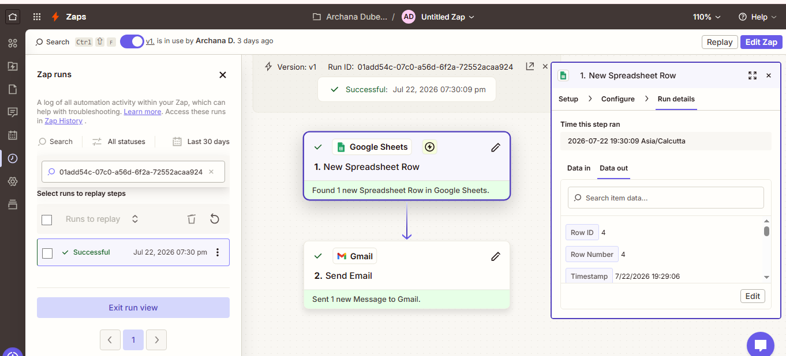
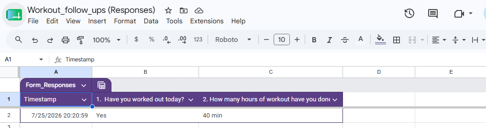

# My Solution

### Tool Used : Google Form, Zapier

---
### Steps to create google form:
1. Open Google Forms.
2. Sign in to your Google account.
3. Click **Blank Form** or choose a template.
4. Enter a title for your form.
5. Add a description (optional).
6. Create your first question.
7. Select the appropriate question type.
8. Enter answer choices (if required).
9. Mark the question as **Required** if needed.
10. Click **+** to add more questions.
11. Insert images or videos (optional).
12. Add sections to organize the form (optional).
13. Customize the form theme and colors.
14. Preview the form.
15. Configure form settings (responses, quizzes, confirmations, etc.).
16. Save your changes automatically.
17. Click **Send**.
18. Share the form via link, email, or embed code.
19. Test the form by submitting a sample response.
20. Monitor responses in the **Responses** tab.
21. Link responses to Google Sheets (optional).
22. Download or analyze responses as needed.
---
### Output Google Form:
https://forms.gle/VW5M5QhTnExZxjrb9

---

### Steps to create AI Automation: Send a Thank You Email After Google Form Submission

1. Create a Google Form.
2. Add all required form fields, including an Email Address field.
3. Test the form by submitting a sample response.
4. Open Zapier and create a new Zap.
5. Select **Google Forms** (or **Google Sheets**) as the trigger.
6. Connect your Google account.
7. Choose the form (or response spreadsheet).
8. Test the trigger to fetch a sample response.
9. Add an **AI by Zapier** action (optional) to generate a personalized thank-you message.
10. Configure the AI prompt using the submitted form data.
11. Add **Gmail** (or Email by Zapier) as the action.
12. Connect your email account.
13. Map the recipient's email address from the form response.
14. Enter a subject line for the email.
15. Map the AI-generated message (or a predefined message) into the email body.
16. Add your signature (optional).
17. Test the email action.
18. Verify that the thank-you email is received successfully.
19. Publish (turn on) the Zap.
20. Submit another form response to verify the complete automation.
21. Monitor Zap history for successful executions.

---

### Output flow from Zapier:

